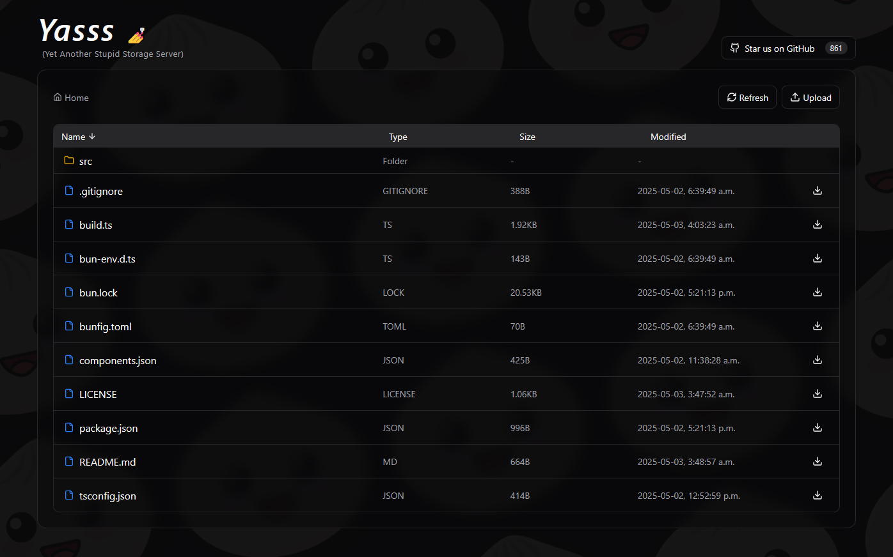

# Yasss - Yet Another Simple Storage Surfer

You know when sometimes you want to access the files of a server remotely for a few minutes and don't want to bother setting some file server? Or when you have SSH access but can't use WinSCP because it doesn't support _ssh-agent_ and they see this as a [low priority issue](https://winscp.net/tracker/1682), and  don't want to use FileZila after the whole [malware fiasco](https://duckduckgo.com/?q=filezilla+malware)?  
  
**_Yasss_ is the solution!**  
With it you can navigate, download, and upload files through the Web UI.  
It is a **zero setup**, portable, temporary web file manager that you run with a single `./yasss` command and stop with `ctrl+c` whenever you want.

> [!CAUTION]  
> The current code base was half vibe-coded, and **it's not ready to be used** by anyone, hence why I'm not even providing release binaries. **Proceed with caution.**




## Development
```sh
# Development (requires https://bun.sh)
bun install
bun run dev
echo "now go to http://localhost:3000"

# Building binaries
# This only partially works, see issue below:
#   https://github.com/oven-sh/bun/issues/17653
bun run build
echo "files should be in ./dist"
```

## TODO

- [ ] Test & harden the upload/download routes
- [ ] Move the path traversal check to the lib folder
- [ ] Config via cli args or yasss.toml
- [ ] Add password auth
    - [ ] modes: 
        - `random`: auto gen at boot (default)
        - `sha256`: the user provides it via config
        - `disabled-and-insecure`: no request auth
    - [ ] send requests with the auth header being `sha256(salt, password, path)`
- [ ] add "auto stop" feature, maybe default
- [ ] create dockerfile
- [ ] for docker images
    - maybe add some ngrok that creates an easy tunnel?
    - maybe use https://sslip.io + lets encrypt?
- [ ] create readme
